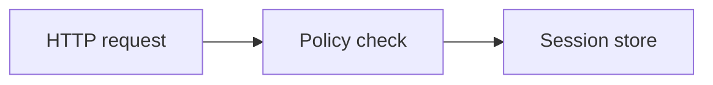

# Codebase explainer authoring contract

Read this file before writing semantic Markdown for a codebase explanation.

## Single-page source

Write `src/index.md` with frontmatter like:

```yaml
---
title: Authentication flow — codebase explanation
site-name: Codebase Explainer
lang: en
layout: wide
has-code: true
has-diagrams: true
---
```

Set `has-code` only when the page contains code blocks. Set `has-diagrams` only
when it contains Mermaid blocks. The template loads only the components selected by
those flags; the site build may stage unused shared assets for another page. Use
`wide` when code, diagrams, or evidence tables are central; otherwise use
`standard`.

Use an H1 in the Markdown body. The opening screen should establish:

- the reader's question and the short answer;
- the exact snapshot (commit/ref plus dirty state when applicable);
- the investigated scope and the meaningful exclusions.

Then choose the sections that serve the purpose. A useful default is:

1. mental model and system boundary;
2. one or more end-to-end implementation paths;
3. key abstractions, state, and contracts;
4. where and how the reader would make the relevant kind of change;
5. incidental concerns and intentional trade-offs;
6. evidence, confidence, and uninvestigated areas.

Do not force an empty section into the document.

## Evidence notation

Keep source coordinates portable:

````markdown
`src/auth/session.ts:48` — session creation starts only after both checks pass.

```ts
if (!account || !verifyPassword(input, account.hash)) return denied();
return sessions.create(account.id);
```
````

Use short excerpts copied exactly from the recorded snapshot. Do not add ellipses
that make code appear executable when it is not. Explain the semantic point after
the excerpt; syntax highlighting is not an explanation.

Use stable remote blob links pinned to the resolved commit when available. For local
or private-only code, show repository-relative `path:line` text without inventing a
URL. Link external sources directly.

Use explicit labels when provenance would otherwise be ambiguous:

- `Observed implementation:` for a conclusion from code or configuration;
- `Documented intent:` with the source that states it;
- `Inference:` for reconstructed rationale;
- `Concern:` for an issue encountered within the investigated path.

Ordinary factual walkthrough prose does not need a label on every sentence. Label
the boundary where a reader could mistake interpretation for established intent.

Use base semantic callouts rather than custom HTML:

```markdown
::: {.callout variant=key}
[Documented intent]{.label} The ADR chooses an append-only log so replay remains
the recovery mechanism.
:::

::: {.callout variant=warn}
[Concern]{.label} Replay has no cancellation boundary in the path inspected here.
This explanation did not audit other consumers.
:::
```

## Diagrams

Use Mermaid only for an important relationship, boundary, state transition, or
execution sequence. Quote labels containing spaces or punctuation.



Do not assign colors by module or layer. Color is reserved for meaning; most
architecture diagrams should work without custom colors.

## Multi-page source

Use site mode only when topics can be read independently. Every `src/*.md` uses the
same frontmatter plus:

```yaml
site-mode: true
```

The landing `index.md` gives the shared mental model and links every topic using a
filterable card grid. Topic pages contain their own short orientation but link
shared facts back to the overview instead of duplicating them.

Create `src/nav-manifest.js` with every topic page exactly once in reading order;
omit the landing page:

```js
window.__HTMLDOCS_NAV = {
  pages: [
    { slug: "request-flow", href: "request-flow.html", kicker: "Execution path", title: "Request flow" },
    { slug: "state", href: "state.html", kicker: "State model", title: "State and persistence" }
  ]
};
```

Each `href` must match a Markdown basename. Escape JavaScript string contents and
keep page order deterministic.

## Build

Resolve this skill's directory as `CODEBASE_EXPLAINER_DIR`.

Single page (the default, inlined local assets):

```bash
bash "$CODEBASE_EXPLAINER_DIR/scripts/build.sh" <OUTPUT>/src/index.md <OUTPUT>
```

Multi-page site (input type selects site mode):

```bash
bash "$CODEBASE_EXPLAINER_DIR/scripts/build.sh" <OUTPUT>/src <OUTPUT>/site
```

Pass `--copy` for a single page only when sidecar assets are explicitly wanted.
Site output is installed only after all pages build and its destination must be
absent or empty; never clear an existing site without user approval.
The build requires Pandoc on `PATH` or the shared HTML skill's bundled Nix runtime.
